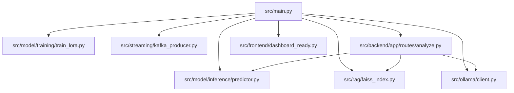

# 🏗️ Financial Sentiment AI - Module Structure

```
Financial-Sentiment-AI/
│
├── 📄 requirements.txt
├── 📄 pyproject.toml
├── 📄 docker-compose.yml
├── 📄 README.md
└── src/
    │
    ├── 🟦 src/main.py (Entry Point)
    │   ├── imports all key modules
    │   └── runs production pipeline
    │
    ├── 🟩 src/model/ (Core ML Modules)
    │   ├── __init__.py
    │   │
    │   ├── 📂 src/model/training/
    │   │   ├── __init__.py
    │   │   └── 📄 train_lora.py
    │   │       ├── LoRA fine-tuning
    │   │       ├── PEFT integration
    │   │       └── GPU-optimized
    │   │
    │   └── 📂 src/model/inference/
    │       ├── __init__.py
    │       └── 📄 predictor.py
    │           ├── GPU predictions
    │           ├── confidence scores
    │           └── label mapping
    │
    ├── 🟨 src/rag/ (Retrieval-Augmented Generation)
    │   ├── __init__.py
    │   └── 📄 faiss_index.py
    │       ├── FAISS IndexFlatL2
    │       ├── 384-dim embeddings
    │       └── k=3 retrieval
    │
    ├── 🟪 src/ollama/ (Explainable AI)
    │   ├── __init__.py
    │   └── 📄 client.py
    │       ├── Mistral prompt
    │       ├── analysis format
    │       └── async support
    │
    ├── 🟧 src/streaming/ (Kafka Integration)
    │   ├── __init__.py
    │   └── 📄 kafka_producer.py
    │       ├── JSON serialization
    │       └── topic: financial-news
    │
    ├── 🟦 src/backend/ (FastAPI Backend)
    │   ├── __init__.py
    │   │
    │   ├── 📂 src/backend/app/
    │   │   ├── __init__.py
    │   │   │
    │   │   ├── 📂 routes/
    │   │   │   ├── __init__.py
    │   │   │   └── 📄 analyze.py
    │   │   │       └── POST /analyze
    │   │   │
    │   │   ├── 📂 schemas/
    │   │   │   ├── __init__.py
    │   │   │   └── 📄 request.py
    │   │   │       └── Pydantic models
    │   │   │
    │   │   ├── 📂 services/
    │   │   │   ├── __init__.py
    │   │   │   └── 📄 advanced_service.py
    │   │   │       ├── sentiment analysis
    │   │   │       ├── RAG retrieval
    │   │   │       └── Ollama explanation
    │   │   │
    │   │   └── 📂 ml/
    │   │       ├── __init__.py
    │   │       └── 📄 predictor.py
    │   │           └── imports inference
    │   │
    │   └── 📂 src/backend/tests/
    │       ├── __init__.py
    │       └── 📄 test_routes.py
    │           └── pytest tests
    │
    └── 🟩 src/frontend/ (Streamlit UI)
        ├── __init__.py
        └── 📄 dashboard_ready.py
            ├── sentiment input
            ├── results display
            └── context visualization
```

## 📊 Module Dependencies



## 🎯 Module Responsibilities

| Module | Responsibility | Key File |
|--------|---------------|----------|
| **Training** | LoRA fine-tuning | `model/training/train_lora.py` |
| **Inference** | GPU predictions | `model/inference/predictor.py` |
| **RAG** | Context retrieval | `rag/faiss_index.py` |
| **Ollama** | Explainable AI | `ollama/client.py` |
| **Streaming** | Kafka events | `streaming/kafka_producer.py` |
| **Backend** | API routes | `backend/app/routes/analyze.py` |
| **Frontend** | UI dashboard | `frontend/dashboard_ready.py` |

## 🔗 Data Flow

```
Text Input → Backend API → Advanced Service
                     ├─→ Predict Sentiment (Model)
                     ├─→ Retrieve Context (RAG)
                     └─→ Generate Explanation (Ollama)
                     ↓
              JSON Response → Kafka → Frontend Display
```

## 📦 Docker Services

| Service | Port | Purpose |
|---------|------|---------|
| Backend | 8000 | FastAPI endpoints |
| Ollama | 11434 | AI explanations |
| Kafka | 9092 | Event streaming |

## 🚀 Module Initialization Order

1. **Dependencies** (requirements.txt)
2. **Model** (train/load)
3. **RAG** (index data)
4. **Backend** (FastAPI)
5. **Frontend** (Streamlit)
6. **Streaming** (Kafka producers)
